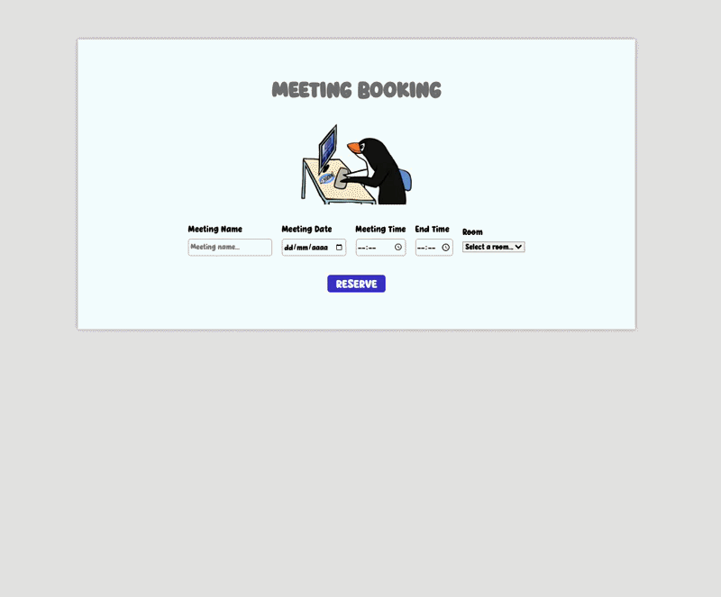
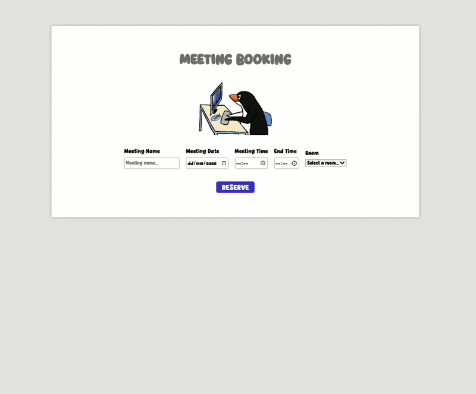
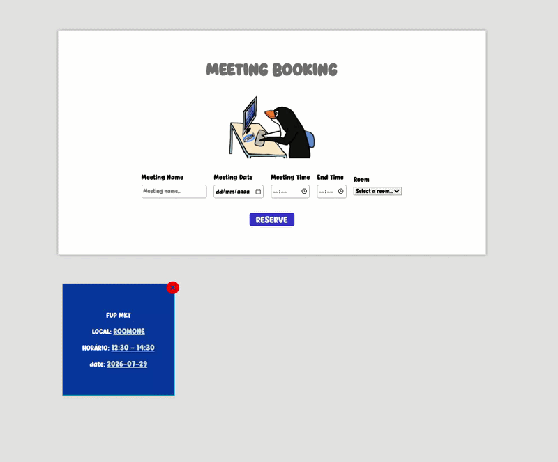
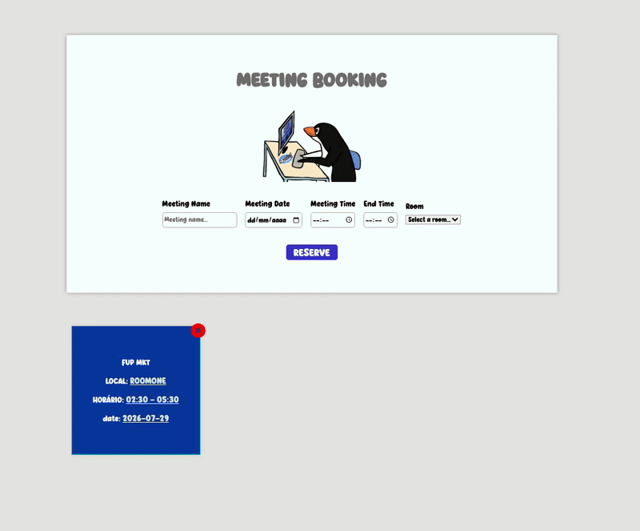

# 🗓️ Virtual Meeting Booking System

A lightweight, responsive web application designed for booking and managing meeting room schedules. Built with **React** and **Vite**, this application prevents double-booking conflicts and validates room availability in real-time.

---

## 🚀 Features

- **Room Reservation:** Schedule meetings by selecting a name, date, start time, end time, and specific room.
- **Conflict Prevention:** Built-in validation that checks and prevents overlapping bookings for the same room and date.
- **Time Validation:** Prevents invalid booking inputs (e.g., end time set earlier than start time).
- **Interactive UI Cards:** Dynamically displays booked meetings as grid items.
- **Custom Reusable Modal:** Custom modal overlay for error feedback and confirmation prompts before deleting a booking.
- **Responsive Layout:** Adaptive user interface optimized for desktop, tablet, and mobile displays.

---

## 🛠️ Tech Stack

- **Frontend Framework:** [React](https://react.dev/)
- **Build Tool:** [Vite](https://vitejs.dev/)
- **Styling:** CSS3 (Flexbox & CSS Grid, Custom Fonts, Media Queries)

---
## 📍 The Process

I had previously built this project using Vanilla JS. As I'm currently learning React, I decided to refactor it using the library. The CSS is a bit unorganized—mainly due to mixed English and Portuguese naming conventions—but you should still be able to navigate and review the code easily.

## Preview/Demo

Creating a meeting

Empty fields error

Conflict on the reserve

Deleting a meeting

